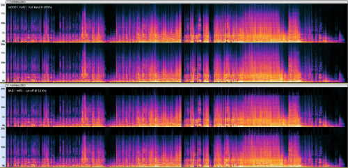

# 🎵 KaraFan  [](https://github.com/Captain-FLAM/KaraFan/stargazers) [](https://github.com/Captain-FLAM/KaraFan/blob/master/LICENSE)

The BEST music separation model with help of **A.I** ... to my ears ! 👂👂

As you've guessed, it was made specially for Karaoke (▶️ focus on musical part).  
This project is **open to all goodwill**.

[](images/KaraFan.png)

## 💲 DONATE

If you want to encourage me to give more time to improve this project :

[](https://www.buymeacoffee.com/Captain_FLAM) &nbsp;
[](https://www.buymeacoffee.com/Captain_FLAM)  
[](https://www.buymeacoffee.com/Captain_FLAM/membership) &nbsp;
[](https://www.buymeacoffee.com/Captain_FLAM/wishlist)

You can become one of my patrons :

[](https://www.patreon.com/Captain_FLAM/membership)

And if you have some Bitcoins (or cryptos) that you don't know what to do with,  
click here to send me an email, I'll give you my wallet address :

# [](mailto:Captain_FLAM@gmx.fr) 😍

You can reach me by [email](https://github.com/Captain-FLAM) or **Join all of us** on this  [ Discord server](https://discord.com/channels/708579735583588363/887455924845944873) !

# 📖 Table of Contents

- [🔥 Introduction](#-introduction)
- [💤 An Old Dream](#-an-old-dream)
- [🧒 Biography](#-biography)
- [📆 History](#-history)
- [📈 Changes Log](#-changes-log)
- [🤡 My Advices](#-my-advices)
- [🚀 Installation](#-installation)
- [📂 Structure](#-structure)
- [💡 Technical Details](#-technical-details)
- [🦄 Near Future](#-near-future)
- [😍 Wall of Fame](#-wall-of-fame)
- [📝 Todo List](#-todo-list)
- [💗 Special Thanks To...](#-special-thanks-to)
- [📜 LICENSE](#-license)

----

# 🔥 INTRODUCTION

I'm an amateur Rock singer who has often been disappointed by the inability to find songs of my favorite singers in the vast KAR databases I possess, or in the extensive library of thousands of songs offered by « KaraFun » (with a paid subscription).

Of course, you have all the singers's best-of, but it's not always the songs you want to sing.

And if the singer is not very famous, you'll find 3-4 songs with real musicians playing or you will have to sing on a MIDI file, which is not very pleasant (even with "Sound Fonts"), or you can forget it ... until ...

# 💤 AN OLD DREAM

Since my childhood, I sing everytime and I've been dreaming of a software that would allow me to remove the voice of a song to sing on it.

TODAY, I'M 54 YEARS OLD, I'M STILL SINGING, AND MY DREAM HAS COME TRUE !

Now, I have the ability to create my own « **KFN** » files for my favorite songs, featuring real musicians who played on the original track, and use them with my beloved software : « KaraFun » 🎤💋

[KaraFun](https://www.karafun.com/) is a free software that you can use to play Karaoke files on your PC.  
They have subscription plans to access their huge library of songs, but you can also use for free with **your own** MID, KAR, CDG & KFN files !!

Perhaps it's time to turn on your dreams too ... ?

# 🧒 BIOGRAPHY

Programmer since the age of 12 (1981).  
Before, I developed in ASM, C, C++, Basic, Visual Basic.  
Since the year 2000, I have been coding in PHP, MySQL, JavaScript, jQuery, HTML, CSS.

And today in Python. ❤️

----

# 📆 HISTORY

I first started with the Demucs facebook research model, but I was disappointed with the results, especially with the instrumental part.

Then I discovered the MDX model, and I was amazed by the quality of the results, especially with the vocals and the instrumental part.

But I was still disappointed with the instrumental part, which was **not shining enough** for me.

So I decided to create my own process, based on the MDX models, but with the **best instrumental** that I could get.  
(Remembers : It's for **Karaoke !**).

I also added a few tricks to improve the quality of the results.

# 📈 CHANGES LOG

| Date | Version | Description |
| ---- | ------- | ----------- |
| 2023-09-08 | 1.2 | Possibility to choose any MDX A.I models for Instrum & Vocals<br>New download system for Models (stay in GUI) |
| 2023-09-06 | 1.1 | - Bugs Fixed with the returns of Discord's people<br />- One can choose the ouput directory |
| 2023-09-05 | 1.0 | First version[ dropped on Discord](https://discord.com/channels/708579735583588363/887455924845944873/1148718029857890324) (buggy) |
| 2023-09-03 | 0.8 | Post the first R.T.F.R.M. (Read The Fucking "READ ME") on GitHub |
| 2023-08-19 | 0.5 | - Inform people on Discord that I'm working on a it...<br />« KaraFan » was born ! 🎉🎉🎉 |
| 2023-08-03 | 0.1 | I started to dig infos on Discord to find the best models & process to use<br />(follow this link if you wanna [read all the story](https://discord.com/channels/708579735583588363/887455924845944873/1136629816246935654) since the beginning ...) |
| 2023-07-12 | 0.0 | I found & tried the wonderful Facebook Demucs models, and the idea started to grow in my mind ... |

# 🤡 MY ADVICES

... to get the best instrumental results :

- Use a **Full Band** input audio files (preferably FLAC instead of MP3).
- Save your audio files in **FLAC** format instead of MP3, because it's a destructive format !  
  (by e.g : I had to propose to you ONLY the CBR 320k Joint-Stereo to avoid Cut-OFF @ 16 Khz in saved files).
- Use the **« SRS »** option (see below) to get a full band result with the Narrow Band voices models.  
  (it can helps to get more brillant vocals)
- Check the quality of the **input audio** file in Audacity (with **Linear Spectrogram** view) to have at least 20 Khz of Bandwidth.  
[](images/Advice_Spectrogram.jpg)

and ...  
With the choice of Models in new **version 1.2** :
1. Choose a very hard song that you've failed to separate before and that you know by heart.
2. Try all the Vocals models one by one, and compare the results with Audacity.  
	(with **RMS Contrast Analyse of dB levels** and **Linear Spectrogram** views)
3. Choose the best model for **Vocals** first
4. Then, you can eventually affinate the choice of the best model for **Instrum**  
	(and **re-process** Vocals again)  
	(and don't forget to check the **bleedings** with DEBUG mode)

---

# 🚀 INSTALLATION

📦 **Prerequisites**

- **Python 3.10**  (Torch CUDA doesn't work yet with 3.11 !)
- PyTorch CUDA

You can run KaraFan with any [Frontends that support Jupyter widgets](https://github.com/jupyter/jupyter/wiki/Jupyter-Widgets#frontends-that-support-jupyter-widgets)

Your **CONFIGURATION** will be saved each time you click the « **Start** » button.

I develop this project with **GUI** in mind and it works :

### ✅ on Google Colab

1️⃣ Go there : [](https://colab.research.google.com/github/Captain-FLAM/KaraFan/blob/master/KaraFan.ipynb)

and **copy** this Colab notebook on your Google Drive.  
(Menu > File > Save a copy on Drive)

2️⃣ Run your Colab Notebook and authorize the access to your Google Drive ... That's it ! 😎

**IMPORTANT** :  
If the system disconnects while saving an audio file, you will need to delete this file before restarting Colab, as the saved file may be incomplete !!  
And especially if the "**GOD Mode**" is activated !

### ✅ on Your PC with Visual Studio **Code**

1️⃣ Install the Jupyter extension from Microsoft in VS Code

2️⃣ Choose a folder on your PC where you wish to store the « KaraFan » project and **go inside it**.

- You can pick any folder you want, but it's better to take the same folder where you store your Google Drive.
- For example, on my PC : I have a folder named « Mon Drive » (in french) that is synchronized with my Google Drive.

3️⃣ Clone this repository in this folder by using the command line :

```bash
git clone https://github.com/Captain-FLAM/KaraFan.git
```

Or if you don't have **Git** installed, you can download the zip file and unzip it in the folder you created.

But you will have to download & unzip the zip file again each time you want to update the project when a new version is available.

4️⃣ Install **only once** PyTorch CUDA :

- Windows :

```bash
Install.bat
```

- Linux / Mac :  
  Go to the [PyTorch website](https://pytorch.org/get-started/locally/) to pick the installation command that fits your system.

5️⃣ Run the Notebook ... That's it ! 😎

### ✅ on Your PC with a command line in a shell :

Follow the steps 2️⃣ , 3️⃣ , 4️⃣ as for Visual Studio Code.

5️⃣ Go inside the folder « KaraFan » and execute the following command to install all the required Python packages :

```bash
py -3.10 -m App.setup
or
python -m App.setup
```

(this command **works also to update** the project with Git on Windows, Linux & Mac)

**Examples of usage :**

```bash
py -3.10 -m App.inference --help
or
python -m App.inference --help
```

```bash
python -m App.inference --input song1.mp3 song2.flac song3.wav --use_config
```

*Use «* Config_PC.ini *» instead of specifying all options in command line.*  
*You **still need** to specify the input files or songs folder.*

```bash
python -m App.inference --input song1.mp3 song2.flac song3.wav --output Results --output_format MP3 --overlap_MDX 0.25 --chunk_size 500000 --DEBUG --GOD_MODE
```

# 📂 STRUCTURE

After installation, you'll find new folders at the root of your Google Drive with the following structure :

| Folder             | Function                                                  |
| ------------------ | --------------------------------------------------------- |
| / KaraFan          | (the root)                                                |
| / KaraFan / App    | This is the main Application                              |
| / KaraFan / Models | Where all the models are stored                           |
| / Music            | Here you can put your audio files (or choose another one) |
| / Results          | Here you will find your extracted audio files (or choose another one) |

---

# 💡 TECHNICAL DETAILS

## « My Magic Recipe »

For now, I use only these 2 MDX models : « **Int HQ 3** » & « **Kim Vocal 2** »  
(I know some people prefer the « **Voc_FT** » model, but personally I found it muddier than Kim Vocal 2 in my tests)  
\--

| Step | Filename |
| ---- | -------- |
| 1 - Normalization of Original audio | 1 - NORMALIZED.flac |
| 2 - Instrumental Extraction from Normalized | 2 - Music_extract.flac |
| 3 - Volume Compensation for Instrumental | *(internal)* |
| 4 - Subtraction of Instrumental from Normalized | 3 - Audio_sub_Music.flac |
| 5 -**Final** Vocal Extraction from cleaned "Audio_sub_Music" | 4_F - Vocals.flac |
| 6 - Volume Compensation for Vocals | *(internal)* |
| 7 -**Final** Subtraction of Vocals from Normalized | 5_F - Music.flac |
| 8 - Bleeding Vocals/Other in final "Music" | 6 - Bleeding_in_Music.flac |

Details of each step :

 1️⃣ **Normalization of Original audio**

- Normalize audio to -1.0 dB peak amplitude

This is mandatory because every process is based on RMS dB levels.  
(Volumes Compensations & audio Substractions)

2️⃣ **Instrumental Extraction from Normalized**  
You will understand that I only use this model to extract the instrumental part to have at most a clean vocals, but it is not used in the final result.  
In all my tests, I saw (in Audacity) & heard that this helps to reduce the artifacts in the final Vocals result.

- Use the **MDX model** to isolate the instrumental parts of the audio track.

3️⃣ **Volume Compensation for Instrumental**

- Internal step involving volume compensation for the extracted instrumental.

4️⃣ **Subtraction of Instrumental from Normalized**  
The instrumental part is then subtracted from the previously normalized to obtain an audio track with only vocals.

- Isolate the vocal parts.

5️⃣ **Vocal Extraction from cleaned "Audio_sub_Music"**

- Use the **MDX model** to isolate the vocal component of the music track, removing any remaining instrumental or background noise.

6️⃣ **Volume Compensation for Vocals + « Silent »**

- Internal step involving volume compensation for the extracted vocal audio.
- Pass the result trough the **« Silent » filter** (read below ...)

7️⃣ **Subtraction of Vocals from Normalized**  
The vocal parts are subtracted from the previously normalized to obtain an audio track with only instrumental music.

- Isolate the instrumental component from the original audio normalized.

8️⃣ **Bleeding Vocals/Other in "Music"**  
The bleeding vocals or other elements are obtained by subtracting 1st "Music_extract" track from the final "Music" track.

- Obtain an audio track that contains any residual vocal or other elements present in the final instrumental music.

These steps collectively represent the audio processing workflow, which separates vocals and instruments from a music track and handles various audio adjustments and filtering.  
Some steps involve internal operations without generating separate output files.

### Volume Compensations

These are **very important values** that needs to be **fine-tuned for each model**, to obtain the best results.

Volume compensation is a process that adjusts the volume of the audio to compensate for the volume changes that occur during the separation process.  
This is necessary because the volume of the audio is reduced during the separation process.   
The volume compensation process is performed internally and does not generate a separate output file.

### About « Silent » filter

Make silent the parts of audio where dynamic range (RMS) goes below threshold.  
Don't misundertand : this function is NOT a noise reduction !  
Its behavior is to clean the audio from "silent parts" (below -50 dB) to :

- avoid the MLM model to work on "silent parts", and save GPU time
- avoid the MLM model to produce artifacts on "silent parts"
- clean the final Vocals audio files from residues of "silent parts" (and get back them in "Music")

### GOD MODE ??

Give you the GOD's POWER : each audio file is reloaded IF it was created before,  
NO NEED to process it again and again !!

You'll be warned : You have to delete MANUALLY each file that you want to re-process !

by e.g :

- you process the song for the first time
- then decide that Vocals are not good :
  - Keep the "1 - Music_extract" & "2 - Audio_sub_Music" files
  - Delete the "3 - Vocals" & "4 - Music" files
  - Modify parameters as you want
  - Click on « Start » button again

It will re-process only 3 & 4 and load 1 & 2 instead of re-processing it ... got it ?

## « SRS » - Soprano mode by Jarredou

Option to use the soprano mode as a model bandwidth extender to make narrowband models fullband. (At least those with a cutoff between 14 Khz - 17.5 Khz).

**Description of the trick :**

* process the input audio at original sample rate
* process the input audio with shifted sample rate by a ratio that make the original audio spectrum fit in the model bandwidth, then restore the original samplerate
* use lowpass & highpass filters to create the multiband ensemble of the 2 separated audio, using the shifted sample rate results as the high band to fill what's above the cutoff of the model.
* with scipy.signal.resample_poly, a ratio of 5/4 for up/down before processing does the trick for models with cutoff at 17.5khz

**User Stories/Use Cases/Benefits:**

Fullband results with "old" narrowband models

**Potential Challenges/Considerations:**

A smooth transition with zerophase soft filtering between the 2 bands works better than brickwall filters, around 14000 hertz was a good value in my few tests.  
Make sure to not have volume changes in the crossover region (I've used Linkwitz-Riley filters).

Downside is first, the doubled separation time because of the 2 passes, and that the separation quality of the shifted sample rate audio is often lower than the normal processed one, but in most of the cases, as it's using only its high freq, it's enough the make that "fullband trick" works very well !

---

# 🦄 NEAR FUTURE

You will see ... I have hundreds of ideas, but I need time to implement them.

And as I'm an independent developer, I have to work to earn my living.

So if you want to encourage me to give more time to improve this project,  
you can make a donation or become one of my patrons :

🎵 **[Go back to the top of this page](#-karafan)** 🎵 where you can find the donation buttons.

**This helps me to :**

- Pay calculation time on Google Colab (100 units = 11 €, I eat all in 3-4 days)
- Perhaps, buy new hardware to make more and more tests to improve the quality of the results.  
  I'm currently using a 4 years old laptop with a GTX 1060 Ti **4GB**  
  I'm dreaming of a RTX 4090 ... and I'm NOT a gamer !  
  ... and if you are too generous, Me can buy an Nvidia A100 40GB !! 😍

---

# 😍 WALL OF FAME

My beloved Patrons & Donators :

- ### Your name here !!

---

# 📝 TODO LIST

My brain is overheating ! 😵

- [X] Add more Models (but NOT with fine-tuned volume compensation for each !)
- [ ] Add a « STOP » button to kill Colab background processes that consume your credits !!
- [ ] Add a TEST option to quickly do only 1 pass on audio files for testing purposes.
- [ ] Automatic fine-tuning of volume compensation for each song (am I Crazy ??).
- [ ] Separate Choirs from Vocals (very hard challenge !)
- [ ] etc ... etc ... etc ..

---

# 💗 SPECIAL THANKS TO...

All these wonderful people without whom this project would not have been possible :

✔️ [Jarredou](https://github.com/jarredou/MVSEP-MDX23-Colab_v2/) - For his multiples **Colab** sharing, for his really helpful hand on Discord, and from whom **I've stolen ALL the code** of inference.py to create my own GUI with it !! 👼

✔️ [Deton 24](https://github.com/deton24/MVSEP-MDX23-Colab_v2.1) - For helping hand and for his very BIG documentation about Music Separation, that you can find **[HERE ! Read it !!](https://docs.google.com/document/d/17fjNvJzj8ZGSer7c7OFe_CNfUKbAxEh_OBv94ZdRG5c/edit)**  
✔️ [Bas Curtiz](https://www.youtube.com/@bascurtiz) - For his Youtube video : [Tips &amp; Tricks - Inverting](https://www.youtube.com/watch?v=FBMOWcDDxIs) that confort my FIRST intuition (after thousands tests 😛) about the importance of cascading the models to improve the quality of the results.  
✔️ [Roman Solovyev (aka ZFTurbo)](https://github.com/ZFTurbo) - For sharing [his code](https://github.com/ZFTurbo/MVSEP-MDX23-music-separation-model) that serve as base to Jarredou & Deton 24 to create their own code.  
And it's also the creator of [MVSEP.com](https://mvsep.com/en), where you can follow the **SDR** evolution of the MDX models : [Quality Checker](https://mvsep.com/quality_checker/multisong_leaderboard?sort=instrum) !

✔️ [Kuielab](https://github.com/kuielab) - Developed the original MDX-Net AI code  
✔️ [Anjok07](https://github.com/Anjok07) & [DilanBoskan](https://github.com/DilanBoskan) - Authors of [Ultimate Vocal Remover GUI](https://github.com/Anjok07/ultimatevocalremovergui) from where ZFTurbo has stolen some parts of code to create his own... 🙄  
✔️ [Kimberley Jensen](https://github.com/KimberleyJensen) - Training the MDX-Net AI models, especially « Kim Vocal 2 » (that won the 3rd place in the « MDX-C 2022 » challenge)  
✔️ [Facebook Research Demucs](https://github.com/facebookresearch/demucs) - For giving me the first steps & the desire to start this project ...

We are all standing on the shoulders of giants !

Thousands Thanks to all of you ! **I love you !** ❤️

---

# 📜 LICENSE

### &copy; Captain FLAM - 2023 - M.I.T license

That means you can do whatever you want with this code, but **YOU HAVE TO** mention my name and the fact that I'm the original author of this code, and mention the names of all the people who have contributed to this project.

**YOU HAVE TO** keep the original license file in your project, and keep the original header with copyrights in each source file.

---
