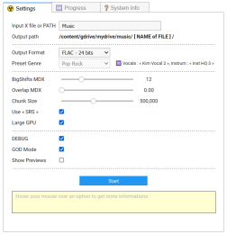

# 🎵 KaraFan   

The BEST music separation model with help of **A.I.** ... to my ears ! 👂👂

As you've guessed, it was made specially for Karaoke (▶️ focus on musical part).  
This project is **open to all goodwill**.  

The Discord community, Chat-GPT & GitHub Copilot ...  and my human intelligence made this project possible.

KaraFan works with **Google Colab** or if you have a decent GPU, on **Your PC** with Visual Studio Code or with a command line in a shell !!

 &nbsp;&nbsp;I'm in love with Copilot ! 😍

## 💲 DONATE

If you want to encourage me to give more time to improve this project :

 &nbsp;
  
 &nbsp;

You can become one of my patrons :

And if you have some Bitcoins (or cryptos) that you don't know what to do with,  
click here to send me an email, I'll give you my wallet address :

##  😍

You can reach me by [email](https://github.com/Captain-FLAM) or **Join all of us** on  [this Discord server](https://discord.com/channels/708579735583588363/887455924845944873) !

# 📖 Table of Contents

- [🎰 Success Story](#-success-story)
- [🔥 Introduction](#-introduction)
- [💤 An Old Dream](#-an-old-dream)
- [🧒 Biography](#-biography)
- [📆 History](#-history)
- [📈 Changes Log](#-changes-log)
- [🧻 in the WIKI now](#-in-the-wiki-now)
- [📂 Structure](#-structure)
- [🦄 Near Future](#-near-future)
- [😍 Wall of Fame](#-wall-of-fame)
- [📝 Todo List](#-todo-list)
- [💗 Special Thanks To...](#-special-thanks-to)
- [📜 LICENSE](#-license)

.

---

# 🎰 SUCCESS STORY

This 12th of September 2023, I've receveid my first compliment from one of KaraFan's users : **SCRFilms** (on Discord) :

> It's weird why Source Separation Ratio (SSR) doesn't exist, it is also a big part of defining quality.  
> Like how well the model separates from it's original signal, how often it false detects other instruments, and stuffs.  
> I can tell not all model are the same and have different SSRs,  
> but tbh, if talking about source separation ratio, **the KaraFan wins from ALL models**  
> Salute.  
> ...  
> eyyy, I find it cool tho where it actually mute the signal when there is no vocals detected.  
> **MDX23C 8k FFT** usually have around **-70dB separation ratio**, but for **KaraFan, it's beyond 120dB** or in short mutes the signal **which is insane !**

We were talking about **SDR score** that define the quality of the separation.  
... and « MDX23C 8k FFT » was actually the BEST model with high SDR score !!

But ... I'm only talking aboout HIFI quality for my ears ... once again.

And also :

I answered **Bas Curtiz** (who made the SDR tests, thanks to him !) in private message :

> I could trick the SDR algo if I would 😉

Remember all of you : I'm a (white hat) hacker ...

---

# 🔥 INTRODUCTION

I'm an amateur Rock singer who has often been disappointed by the inability to find songs of my favorite singers in the vast KAR databases I possess, or in the extensive library of thousands of songs offered by « KaraFun » (with a paid subscription).

Of course, you have all the singers's best-of, but it's not always the songs you want to sing.

And if the singer is not very famous, you'll find 3-4 songs with real musicians playing or you will have to sing on a MIDI file, which is not very pleasant (even with "Sound Fonts"), or you can forget it ... until ...

# 💤 AN OLD DREAM

Since my childhood, I sing everytime and I've been dreaming of a software that would allow me to remove the voice of a song to sing on it.

TODAY, I'M 54 YEARS OLD, I'M STILL SINGING, AND MY DREAM HAS COME TRUE !

Now, I have the ability to create my own « **KFN** » files for my favorite songs, featuring real musicians who played on the original track, and use them with my beloved software : « KaraFun » 🎤💋

[KaraFun](https://www.karafun.com/) is a free software that you can use to play Karaoke files on your PC.  
They have subscription plans to access their huge library of songs, but you can also use for free with **your own** MID, KAR, CDG & KFN files !!

Perhaps it's time to turn on your dreams too ... ?

# 🧒 BIOGRAPHY

Programmer since the age of 12 (1981).  
Before, I developed in ASM, C, C++, Basic, Visual Basic.  
Since the year 2000, I have been coding in PHP, MySQL, JavaScript, jQuery, HTML, CSS.

And today in Python. ❤️

----
----

# 📆 HISTORY

I first started with the Demucs facebook research model, but I was disappointed with the results, especially with the instrumental part.

Then I discovered the MDX model, and I was amazed by the quality of the results, especially with the vocals and the instrumental part.

But I was still disappointed with the instrumental part, which was **not shining enough** for me.

So I decided to create my own process, based on the MDX models, but with the **best instrumental** that I could get.  
(Remembers : It's for **Karaoke !**).

I also added a few tricks to improve the quality of the results.

# 📈 CHANGES LOG

| Date | Version | Description |
| ---- | ------- | ----------- |
| 2023-09-09 | 1.3 | Correct "Linkwitz-Riley" filter (better **SRS**) New download system for Models (stay in GUI) Add TEST MODE (process with only 1 pass) Add "Delete" buttons (works with ONE file and DEBUG & GOD_MODE activated) |
| 2023-09-08 | 1.2 | Possibility to choose any **MDX A.I. models** for Instrum & Vocals New download system for Models (stay in GUI) Saving MP3 with fucking Cut-OFF @ 16 Khz solved ! |
| 2023-09-06 | 1.1 | Bugs Fixed with the returns of Discord's people One can choose the ouput directory KaraFan have **Automagic Updates** system ! |
| 2023-09-05 | 1.0 | First version[ dropped on Discord](https://discord.com/channels/708579735583588363/887455924845944873/1148718029857890324) (buggy) |
| 2023-09-03 | 0.8 | Post the first **R.T.F.R.M.** (Read The Fucking "READ ME") on GitHub |
| 2023-08-19 | 0.5 | - Inform people on Discord that I'm working on a it... « KaraFan » was born ! 🎉🎉🎉 |
| 2023-08-03 | 0.1 | I started to dig infos on Discord to find the best models & process to use (follow this link if you wanna [read all the story](https://discord.com/channels/708579735583588363/887455924845944873/1136629816246935654) since the beginning ...) |
| 2023-07-12 | 0.0 | I found & tried the wonderful Facebook Demucs models, and the idea started to grow in my mind ... |

.

----
----

# 🧻 in the WIKI now

- 🎵 **How To Update ?**
- 🤡 **My Advices**
- 🚀 **INSTALL**
- 🥣 **My Magic « Recipe »**
- 💡 **Technical Details**

### Moved into [the WIKI ... Click to Read ALL !!](https://github.com/Captain-FLAM/KaraFan/wiki)

So for now, in addition to being obliged to **R.T.F.R.M** (Read This Fucking READ ME), you have to **R.T.F.W** (Read The Fucking WIKI) !! 😛

.

# 📂 STRUCTURE

After installation, you'll find new folders at the root of your Google Drive with the following structure :

| Folder             | Function                                                  |
| ------------------ | --------------------------------------------------------- |
| / KaraFan          | (the root)                                                |
| / KaraFan / App    | This is the main Application                              |
| / KaraFan / Models | Where all the models are stored                           |
| / Music            | Here you can put your audio files (or choose another one) |
| / Results          | Here you will find your extracted audio files (or another one) |

.

----
----

# 🦄 NEAR FUTURE

You will see ... I have hundreds of ideas, but I need time to implement them.

And as I'm an independent developer, I have to work to earn my living.

So if you want to encourage me to give more time to improve this project,  
you can make a donation or become one of my patrons :

🎵 **[Go back to the top of this page](#-karafan)** 🎵 where you can find the donation buttons.

**This helps me to :**

- Pay calculation time on Google Colab (100 units = 11 €, I eat all in 3-4 days)
- Perhaps, buy new hardware to make more and more tests to improve the quality of the results.  
  I'm currently using a 4 years old laptop with a GTX 1060 Ti **4GB**  
  I'm dreaming of a **RTX 4090** ... and I'm NOT a gamer !  
  ... and if you are too generous, Me can buy an **Nvidia A100 40GB** !! 😍

.

---

# 😍 WALL OF FAME

My beloved Patrons & Donators :

- ### Your name here !!

.

---

# 📝 TODO LIST

My brain is overheating ! 😵

- [X] Add more Models (but NOT with fine-tuned volume compensation for each !)
- [ ] Add a TEST option to quickly do only 1 pass on audio files for testing purposes.
- [ ] Add a « STOP » button to kill Colab background processes that consume your credits !!
- [ ] Get weak voices with A.I. models with a pre-amplification of low parts of the spectrum.
- [ ] Automatic fine-tuning of volume compensation for each song (am I Crazy ??).
- [ ] Separate Choirs from Vocals (very hard challenge !)
- [ ] etc ... etc ... etc ...  

.

---

# 💗 SPECIAL THANKS TO...

All these wonderful people without whom this project would not have been possible :

✔️ [Jarredou](https://github.com/jarredou/MVSEP-MDX23-Colab_v2/) - For his multiples **Colab** sharing, for his really helpful hand on Discord, and from whom **I've stolen ALL the code** of inference.py to create my own GUI with it !! 👼

✔️ [Deton 24](https://github.com/deton24/MVSEP-MDX23-Colab_v2.1) - For helping hand and for his very BIG documentation about Music Separation, that you can find **[HERE ! Read it !!](https://docs.google.com/document/d/17fjNvJzj8ZGSer7c7OFe_CNfUKbAxEh_OBv94ZdRG5c/edit)**  
✔️ [Bas Curtiz](https://www.youtube.com/@bascurtiz) - For his Youtube video : [Tips &amp; Tricks - Inverting](https://www.youtube.com/watch?v=FBMOWcDDxIs) that confort my FIRST intuition (after thousands tests 😛) about the importance of cascading the models to improve the quality of the results.  
✔️ [Roman Solovyev (aka ZFTurbo)](https://github.com/ZFTurbo) - For sharing [his code](https://github.com/ZFTurbo/MVSEP-MDX23-music-separation-model) that serve as base to Jarredou & Deton 24 to create their own code.  
And it's also the creator of [MVSEP.com](https://mvsep.com/en), where you can follow the **SDR** evolution of the MDX models : [Quality Checker](https://mvsep.com/quality_checker/multisong_leaderboard?sort=instrum) !

✔️ [Kuielab](https://github.com/kuielab) - Developed the original MDX-Net AI code  
✔️ [Anjok07](https://github.com/Anjok07) & [DilanBoskan](https://github.com/DilanBoskan) - Authors of [Ultimate Vocal Remover GUI](https://github.com/Anjok07/ultimatevocalremovergui) from where ZFTurbo has stolen some parts of code to create his own... 🙄  
✔️ [Kimberley Jensen](https://github.com/KimberleyJensen) - Training the MDX-Net AI models, especially « Kim Vocal 2 » (that won the 3rd place in the « MDX-C 2022 » challenge)  
✔️ [Facebook Research Demucs](https://github.com/facebookresearch/demucs) - For giving me the first steps & the desire to start this project ...

We are all standing on the shoulders of giants !

Thousands Thanks to all of you ! **I love you !** ❤️

---
---

# 📜 LICENSE

### &copy; Captain FLAM & Jarredou - 2023 - M.I.T license

That means you can do whatever you want with this code, but **YOU HAVE TO** mention my name and the fact that I'm the original author of this code, and mention the names of all the people who have contributed to this project.

**YOU HAVE TO** keep the original license file in your project, and keep the original header with copyrights in each source file.

---
